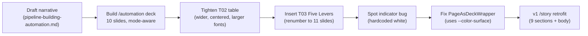

# A second scroll deck — and the first one catches up to the toggle

## Why Care?

Until today, `/story` was the only scroll deck on the hub — the Reach narrative for the current fundraise. That story still stands, but it only answered one side of the partnership: *what Reach is.* The other side — *what Lossless will boot up for Reach next* — was sitting in a working doc, not in a thing you could scroll through.

`/automation` is now that scrollable thing. Eleven slides covering the Phase One relief work for the current fundraise team, the three archetypes of philanthropy and how they re-key everything that follows, the operating levers behind every recommendation, the probable stack, and the multivariate-map payoff at the end. The deck is the Lossless side of the table, laid down next to the Reach side.

While we were building it, the mode toggle on `/story` v1 baseline went from "works but barely visible" to obviously broken. Every other surface on the hub responds to light/dark/vibrant — `/automation` toggles, `/story/version-2` toggles, the Header, the Footer, the brand kit. Only the original `/story` v1 was stuck in light mode. Fixed in the same pass — slate-toned for dark, black + orange-on-warm-stone for vibrant. The journalistic register stays journalistic; it just lights three different ways now.

If you're a Reach senior exec dropping into the hub: there's now a deck you can scroll through that names what we're building next, and every page on the hub responds to the mode toggle in the top-right.

## What's New?

- **New scroll deck at `/automation` — 11 slides.** Phase One relief → three archetypes (HNWI / SFO / Institutional) → five operating levers → key players → donor personalization → grant pipeline → the stack → live data sources → widening the aperture → geographic cluster analysis → theme mapping as the payoff.
- **New `Automation` link in the Header chrome.** Between Story and Brand Kit, with active-state styling that reads in all three modes.
- **`/story` v1 retrofitted with mode awareness.** All 9 sections + the page body now carry `dark:` and `vibrant:` variants. The journalistic register is preserved — neutral slate for dark, black + orange + warm-stone for vibrant — so it stays distinct from v2's editorial-indigo register.
- **Section-indicator pill stops being a light-mode artifact.** `PageAsDeckWrapper.astro` swapped a hardcoded `rgb(255 255 255 / 0.9)` background for `var(--color-surface)` on `.section-indicator` and `.nav-hint`. The pill now sits calmly into each background — off-white in light, dark-purple in dark, blended-near-black in vibrant.
- **New narrative outline.** `context-v/narratives/pipeline-building-automation.md` — the slide-by-slide outline for the new deck, with a "Future slide candidates" section pointing at an Inbound/Outbound + Seeds, Spears, and Nets slide for v2.

## The five-minute story

### The disambiguation that re-shaped the deck

We started with a working doc — eight sections of relief work, donor personalization, grant pipeline, stack, data sources, geographic + thematic mapping. Drafting the playback, the gap became obvious: most of the examples were quietly *archetype-specific* and the doc never said so. A "baseball game closes the deal" tactic only applies to Individual HNWI work. "Bourbon with the principal who then routes you back into process" is a Single Family Office story. The "full grant pipeline" is institutional. Same pipeline serves all three — but which surfaces light up, and who from Reach is in the room, depends on which game is being played.

So slide 02 became **Three Games, One Pipeline** — a three-column table (HNWI / SFO / Institutional) × five rows (how they decide / what short-circuits it / where the work happens / who plays / what automation helps). Candid voice: *"a small team that likes to pretend they have process."* Once the archetypes slide existed, every later slide could carry a small archetype chip in the corner — `HNWI · SFO` on the donor-personalization slide, `Institutional` on the grant-pipeline slide — and the reader stops asking "does this apply to me?"

### Five Levers, Often Neglected

After the first build, a second insight slide earned its way in: the operating beliefs behind every recommendation. Five levers, often neglected, rarely well executed:

1. **Planned Serendipity** — going for luck. Heatmap travel for anyone visiting a location. Small travel-budget bumps go a long way. Maximize inbound (SEO/GEO) so aligned people find *us*.
2. **Authenticity & the Mechanics of Liking** — *Familiarity. Similarity. Frequency.* The authenticity has to overcome the tacit knowledge that "all this is planned."
3. **Slow Down to Speed Up** — tinker first, codify second. Beat the Urgent-vs-Important and Rainmaker-vs-Development traps.
4. **Pipelines Must Reflect Messy Reality** — simplicity is an overlay, not a denial. Oversimplified dashboards get ignored within a quarter.
5. **The Coalition of the Willing** — goes commando, leads by doing, doesn't let skeptics stall.

This slide lands as Slide 03 — after the archetype frame, before the player roster — so the levers can re-key how the audience reads the rest of the deck. (Especially "involve more people from Reach than you'd think appropriate," which pre-frames the Key Players slide.)

Inserting it required renaming `T03-…T10-` → `T04-…T11-` on disk and updating every section's `NN / 10` indicator to `NN / 11`. Single sed pass across all nine files.

### The shared-chrome fix

Toggling through modes on `/automation` surfaced an old bug in `PageAsDeckWrapper.astro`:

```css
/* Before — hardcoded white, pops on every dark canvas */
.section-indicator { background: rgb(255 255 255 / 0.9); }
.nav-hint          { background: rgb(255 255 255 / 0.9); }
```

The border and text already used semantic tokens (`var(--color-border)`, `var(--color-text-muted)`) — only the background was off. One-line fix:

```css
/* After — uses semantic surface token, adapts per mode */
.section-indicator { background: var(--color-surface); }
.nav-hint          { background: var(--color-surface); }
```

`--color-surface` was already defined in `theme.css` for all three modes (warm off-white in light, dark-purple in dark, blended-near-black in vibrant). The pill now sits *into* each background instead of glowing on top of it. Lands on all three decks — `/story`, `/story/version-2`, `/automation` — since `PageAsDeckWrapper` is shared chrome.

### The v1 retrofit

The mode toggle on `/story` v1 was the lone holdout. Quick inventory:

| Deck | Sections | Mode variants per section |
|---|---|---|
| `/story` v1 | 9 | **0** |
| `/story/version-2` | 9 | 7–20 |
| `/automation` | 11 | 9–25 (varies by density) |

v1 was authored before the mode wiring landed — the README acknowledges this and calls v1 the "clean / journalistic baseline." But the rest of the hub having a working toggle made v1 read as broken rather than baseline.

The retrofit transforms each color utility into a three-mode triplet. Single sed pass with 15 substitutions:

```bash
sed -i '' \
  -e 's|text-gray-900|text-gray-900 dark:text-slate-50 vibrant:text-stone-50|g' \
  -e 's|text-gray-700|text-gray-700 dark:text-slate-300 vibrant:text-stone-200|g' \
  -e 's|bg-white|bg-white dark:bg-slate-900 vibrant:bg-black|g' \
  -e 's|border-gray-200|border-gray-200 dark:border-slate-700 vibrant:border-orange-500/30|g' \
  # … 11 more rules
  T0*.astro
```

The register choice — slate for dark, black + orange + warm stone for vibrant — deliberately differs from v2's indigo-950 + cyan + serif. v2 is *editorial / literary magazine*; v1 is now *journalistic in three lights* — newspaper in light, newspaper at dusk in dark, newspaper-meets-rock-poster in vibrant. Both decks toggle now, but each keeps its own personality across the three modes.

Body element of `/story/index.astro` got the same treatment so the page bg doesn't show through as white during scroll-snap transitions.

## How the work composes

The four moves above hang together as one pass. The new deck created the visual contrast that made the v1 inconsistency unbearable. The new deck also surfaced the indicator-pill bug, which once fixed benefits the v1 retrofit too. And the v1 retrofit closed the loop on a contract that was implicit in `global.css` since v2 shipped: every component on this hub reads in three modes.



## Files changed

**New — `/automation` deck:**

- `src/pages/automation/index.astro` — page wrapper with boot script, `PageAsDeckWrapper`, 11 sections
- `src/layouts/sections/automation/T01-FirstThingsFirst.astro` — relief opener
- `src/layouts/sections/automation/T02-ThreeGamesOnePipeline.astro` — three-archetypes table
- `src/layouts/sections/automation/T03-FiveLevers.astro` — operating beliefs
- `src/layouts/sections/automation/T04-KeyPlayers.astro` — roster with archetype chips
- `src/layouts/sections/automation/T05-DonorPersonalization.astro` — HNWI · SFO half of Pillar 1
- `src/layouts/sections/automation/T06-GrantPipeline.astro` — Institutional half of Pillar 1
- `src/layouts/sections/automation/T07-ProbableStack.astro` — five layers, tools as captions
- `src/layouts/sections/automation/T08-DataSources.astro` — categories (research-pending)
- `src/layouts/sections/automation/T09-NewIdentification.astro` — aperture-widening pivot
- `src/layouts/sections/automation/T10-GeographicClusters.astro` — where the dollars sit
- `src/layouts/sections/automation/T11-ThemeMapping.astro` — multivariate-map payoff

**New — narrative outline:**

- `context-v/narratives/pipeline-building-automation.md` — slide-by-slide outline with "Future slide candidates" section

**Modified — chrome and routing:**

- `src/components/basics/Header.astro` — new `Automation` nav link between Story and Brand Kit
- `src/lib/seo.ts` — new `SCROLL_DECK_SEO['/automation']` entry
- `src/layouts/PageAsDeckWrapper.astro` — `.section-indicator` and `.nav-hint` backgrounds now use `var(--color-surface)`

**Modified — `/story` v1 retrofit (mode awareness):**

- `src/pages/story/index.astro` — body class
- `src/layouts/sections/story/T01-ApprenticeshipDegree.astro`
- `src/layouts/sections/story/T02-EquityMission.astro`
- `src/layouts/sections/story/T03-ReachMethod.astro`
- `src/layouts/sections/story/T04-Affordability.astro`
- `src/layouts/sections/story/T05-Faculty.astro`
- `src/layouts/sections/story/T06-TeacherPipeline.astro`
- `src/layouts/sections/story/T07-Partnerships.astro`
- `src/layouts/sections/story/T08-ScaleTraction.astro`
- `src/layouts/sections/story/T09-Healthcare.astro`

**Documentation:**

- `changelog/2026-05-11_01.md` — this entry. The changelog directory was promoted from `src/content/changelog/` to the repo-root `changelog/` per the org-wide convention; `src/content.config.ts` glob updated to load from the new location, README updated accordingly.

## Reference

- Source outline: `context-v/narratives/pipeline-building-automation.md`
- Pattern source: `sites/calmstorm-decks/src/layouts/PageAsDeckWrapper.astro`
- Skill: `deck-iteration-workflow` (Phase 1 — Tailwind built-in tokens only)
- Skill: `theme-system` (two-tier tokens + three-mode contract)
- Skill: `astro-knots` (no React, no JSX, semantic HTML first)
- Previous entry: `changelog/2026-05-04_03.md` (the rebrand polish pass)
